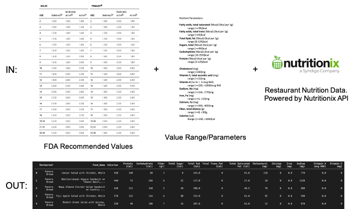
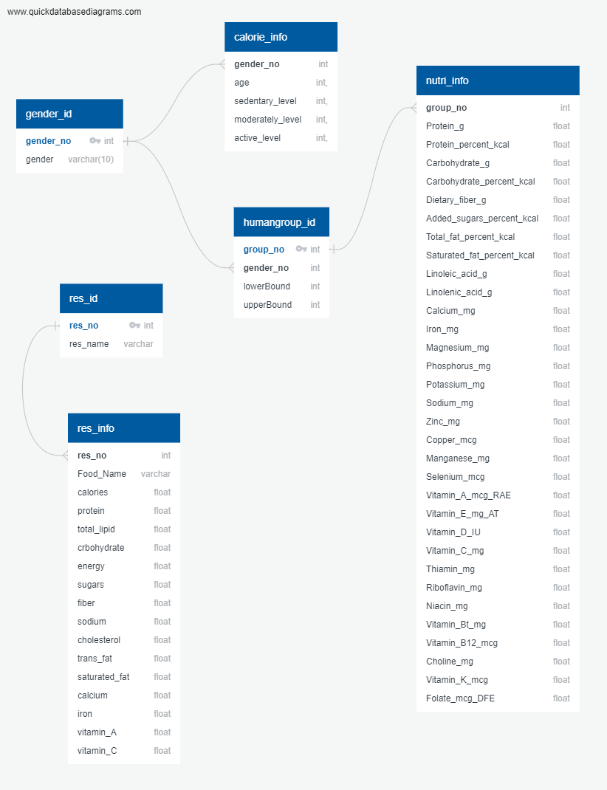

# **ETL Project**

Five local healthy restaurant chains were selected in Austin, Texas.  

Each restaurant’s top 7 menu items were compared against the others based on their nutritional values. 

# **EXTRACT**

Restaurant nutrition data was extracted from the Nutritionix API (https://www.nutritionix.com/business/api) to determine restaurant menu content. 

Recommended dietary values were extracted from USDA’s Food Data Central website (https://fdc.nal.usda.gov/download-datasets.html#bkmk-1) to determine “healthy” parameters.

# **TRANSFORM**
Food Data Central pdfs were converted to CSVs for data processing purposes.

Nutritionix’s API data was transformed from JSON to text and then exported to CSV for data processing, using Jupyter Notebook (see NutrientsConverter.ipnyb).

Nutritionix data was further filtered to display only the restaurants needed for this project (see NutrientsConverter.ipnyb).

# **LOAD**

We loaded our data into a postgres database via pgAdmin4. 

We decided to go with this method because we had a limited dataset of structured data. 

MongoDB would not have been appropriate for this project since we didn’t obtain large amounts of unstructured data. 

This relational database provided easy querying abilities that allowed us to have a smooth load process.
Before we could load our data, we had to transpose the nutri_info table in Excel. 

Initially, this table did not match our existing SQL schema due to the rows and columns being inverted. 

Using the transpose function quickly solved this issue. 

Below is an entity relationship diagram that demonstrates how our tables are structured.

